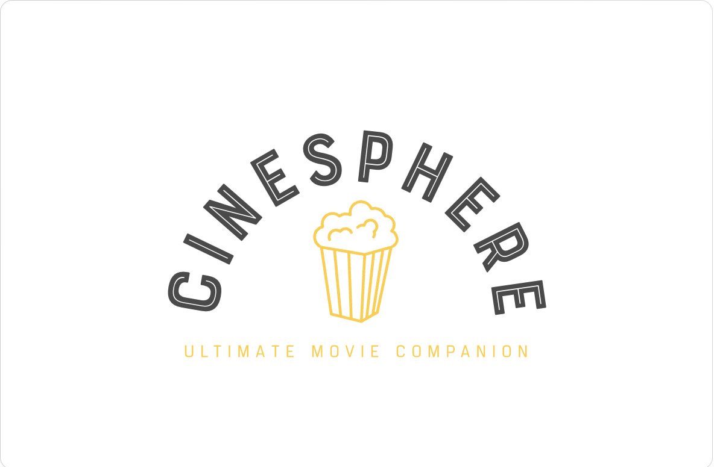
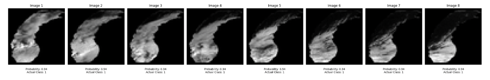
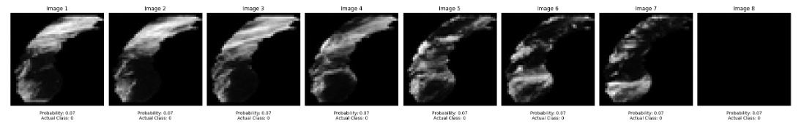
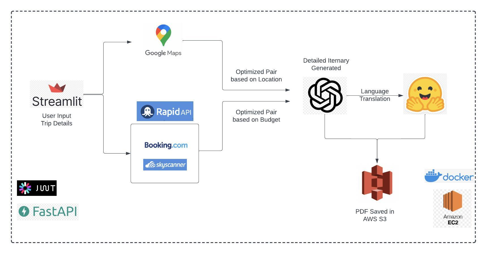
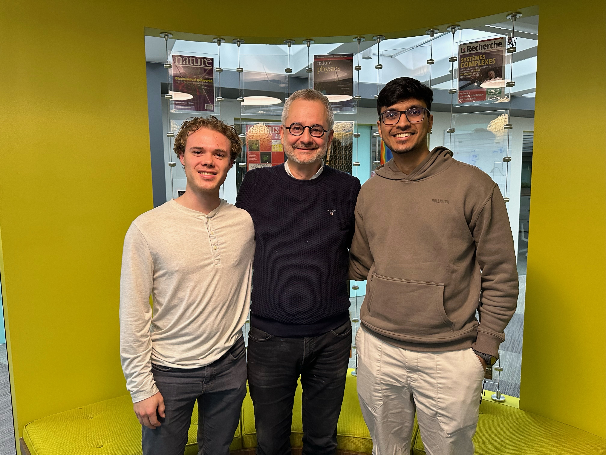
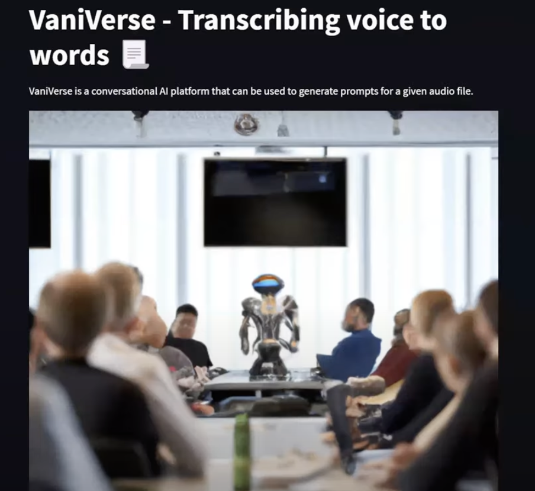
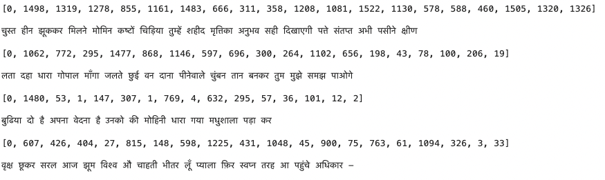
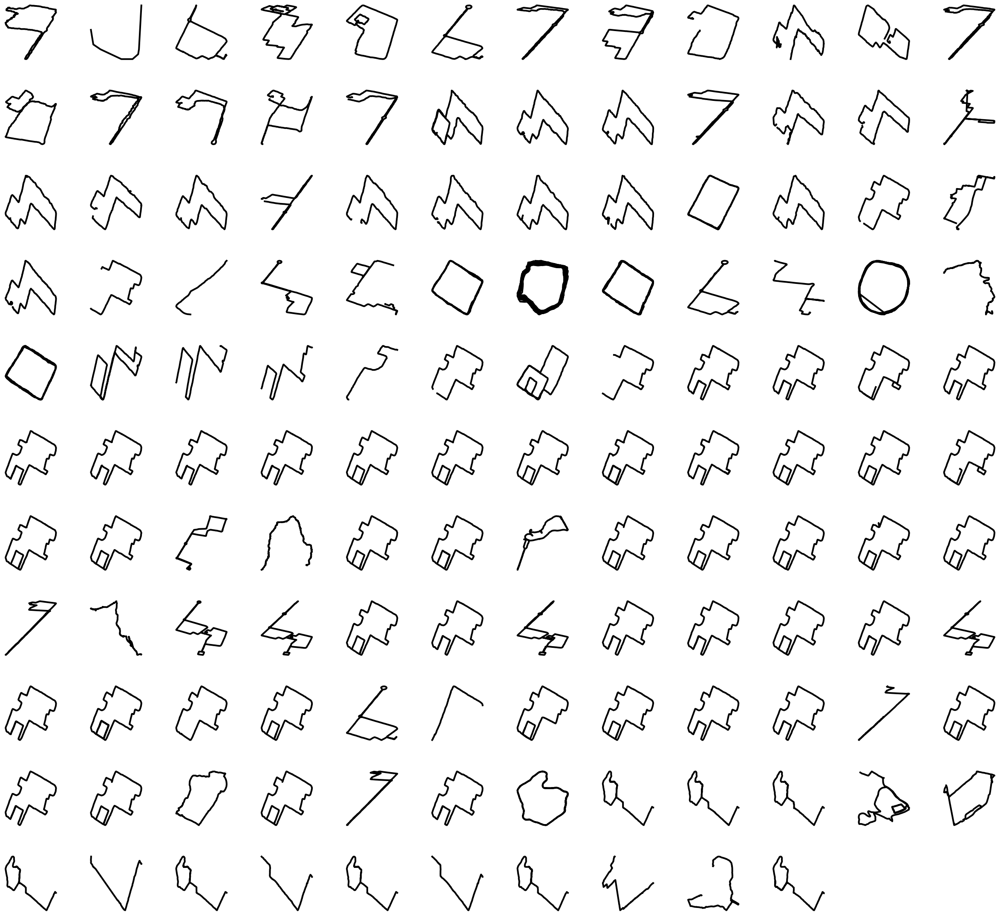

## Portfolio

## About Me

I'm a Data Scientist and Product Developer based in Boston, Massachusetts. In my recent stint at Graduate school, I tried my hands on a variety of topics in the data ecosystem viz. Applied Deep Learning, Data Engineering, and Network Science. I developed a growing interest in Applied research, and end-to-end ML product development, and wish to continue similar work in my next role.

Before this, I enjoyed my work in Credit & Fraud Risk Data Science at American Express, where I got a chance to work on both Modeling and Risk Strategy fronts contributing to Global Collections and US Commercial limits teams.

I'm open to partnering for work and exciting opportunities. Look forward to connecting!
  
[Download Resume](/pdf/Resume_SG.pdf)
  
## Latest Work 

### CineSphere - Movie Recommending Chatbot Using Knowledge Graphs
- Developed a chatbot using GPT4 with multi-agent LangChain Framework and Knowledge Graph over 45K movies 
- Leveraged OpenAI Function Calling, Vector Indexing, and Node similarity algorithms to create robust chat interface and recommendations

### LES Weather Forecasting - Multi-Modal Model Approach
- Developed a classic Encoder-Decoder architecture using ConvLSTM and LSTM for weather forecasting at Lake Michigan 
- Used satellite images and meteorological data to create the model attaining a recall of 0.85 on a highly imbalanced data

---
### TravelBud - AI Tool for Travel planning

- Developed a travel itinerary-generating application optimized based on user areas of interest, budget, and destination
- Leveraged RapidAPI for flight, hotel data, and OPENAI GPT3 for chat completion coupled in a cloud ecosystem

---

### DIME(Database on Ideology, Money in Politics, and Elections) Network Analysis
- Researched DIME data to formulate a network among the monetary contributions in US Federal Elections
- Leveraged network science principles to showcase scale-free properties, and ideology-based communities among contributors 

 

---
### Founder - GrocerEase: Smart Digitization of Groceries
- GrocerEase is a new-age startup helping its users digitize the process of tracking groceries efficiently and simply. We address a very common problem of forgetfulness among grocery shoppers, which results in redundant purchases and food wastage quite often.
- The user just needs to click a picture of the grocery purchase receipt, and the app automatically digitizes the items, along with their quantity in a tabular format, and additionally estimates a tentative expiry date based on the internal database to give out expiry alerts, such that the product can be used before it's about to expire.We use **Deep learning** and **Computer Vision** under the hood to develop our product
- Finished among the Top 5 finalists competing for $10K seed funding in the Husky Startup challenge at Northeastern University (A student-led startup incubator by the Entrepreneurship Cell)

  

---

### VaniVerse
- VaniVerse is a conversational AI platform that can be used to generate prompts for a given audio file
- OPENAI Whisper & GPT API are leveraged to process audio files and generate prompts simultaneously using Airflow 

---
### Hindi Seq2Seq Model - Generating Hindi poems with RNN
- Trained a Sequence Model on a corpus of Hindi Poems to generate new sentences leveraging NLP, text processing principles 
- Used pre-trained tokenizing and word embeddings for the Hindi language developed by AI4Bharat

---

### Runner’s High: Reflecting on Runs in ‘22
In 2022, I took on running as a hobby and set a target of running 500km over the calendar year. Reflecting on the runs, I used Python to visualize the geospatial data collected over the year on Strava, sharing some thoughts and insights!

 

---

Feel Free to email -  
