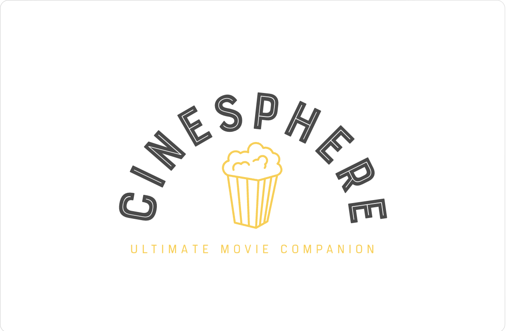
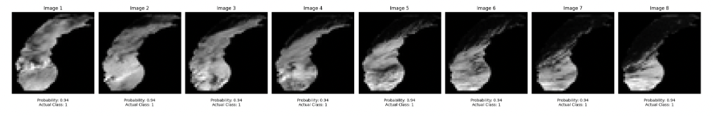
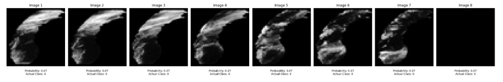
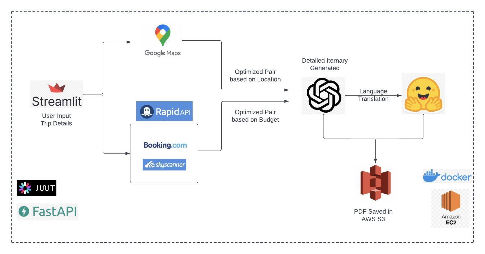
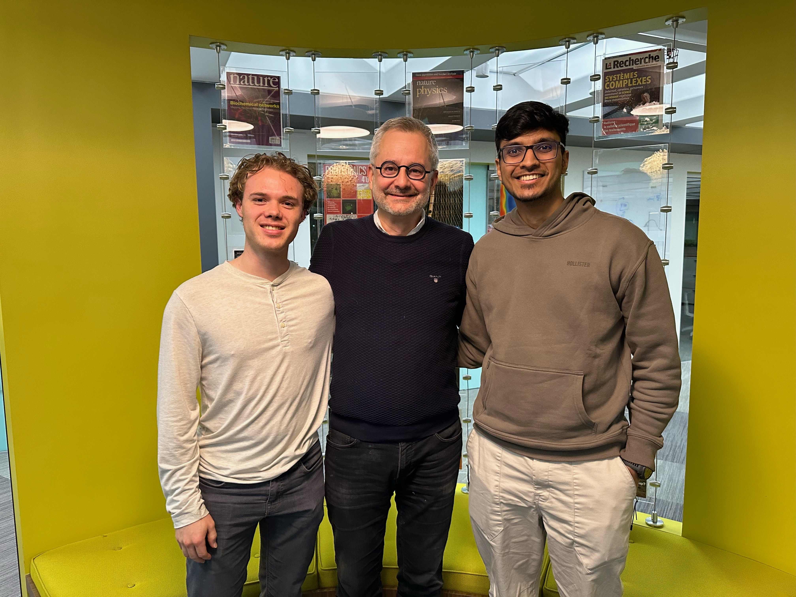
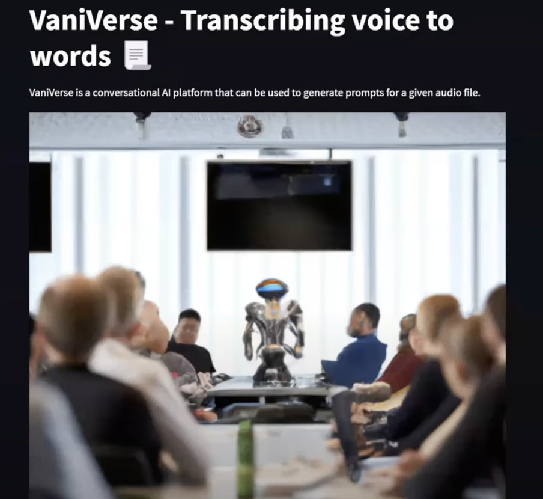
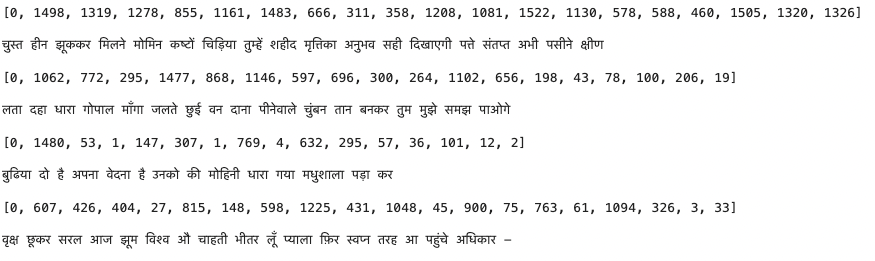
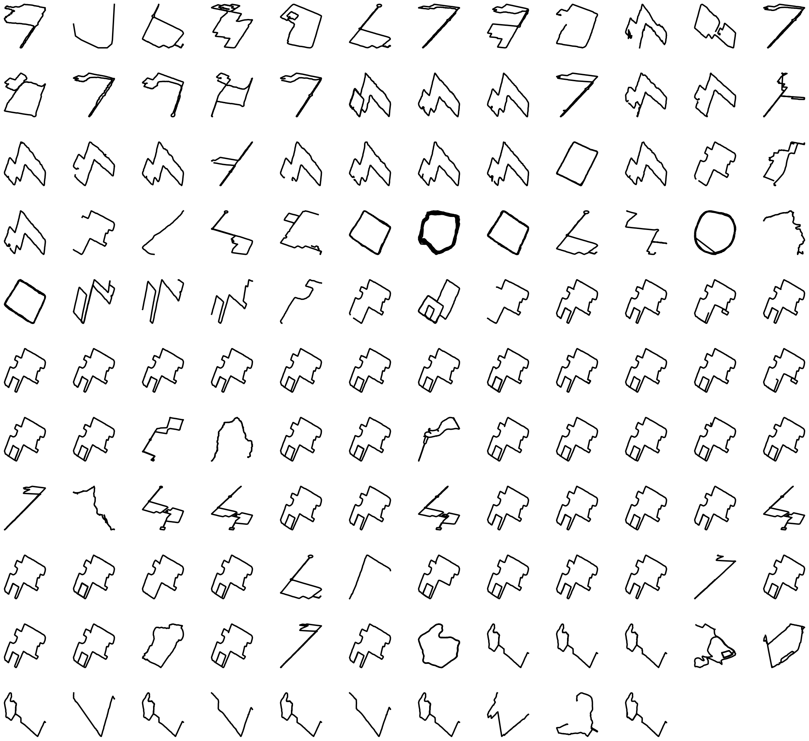

## About Me

I'm a Data Scientist and ML Engineer based in Boston, Massachusetts. My work spans Applied Deep Learning, Data Engineering, and Network Science — with a growing focus on end-to-end ML product development and applied research.

Previously, I worked in Credit & Fraud Risk Data Science at **American Express**, contributing to Global Collections and US Commercial Limits teams across modeling and risk strategy.

I'm open to exciting opportunities and collaborations — let's connect!

## Latest Work

  <h3>CineSphere — Movie Recommending Chatbot Using Knowledge Graphs</h3>
  <ul>
    <li>Developed a chatbot using GPT-4 with multi-agent LangChain Framework and a Knowledge Graph over 45K movies</li>
    <li>Leveraged OpenAI Function Calling, Vector Indexing, and Node Similarity algorithms for robust recommendations</li>
  </ul>
  
  

    
  

  <h3>LES Weather Forecasting — Multi-Modal Model</h3>
  <ul>
    <li>Designed an Encoder-Decoder architecture using ConvLSTM and LSTM for weather forecasting at Lake Michigan</li>
    <li>Combined satellite imagery with meteorological data; achieved recall of 0.85 on highly imbalanced data</li>
  </ul>
  
  
  

    
  

  <h3>TravelBud — AI Tool for Travel Planning</h3>
  <ul>
    <li>Built a travel itinerary-generating app optimized for user interests, budget, and destination</li>
    <li>Leveraged RapidAPI for flight &amp; hotel data and OpenAI GPT-3 for chat completion in a cloud ecosystem</li>
  </ul>
  
  

    
  

  <h3>A/B Test — Understanding Causal Relationships in Experiments</h3>
  <ul>
    <li>Published an in-depth article explaining A/B test implementation and how they reveal causal relationships in experiments</li>
  </ul>
  
  

    
  

  <h3>DIME Network Analysis — US Federal Election Money</h3>
  <ul>
    <li>Researched DIME data to map monetary contribution networks in US Federal Elections</li>
    <li>Applied network science to reveal scale-free properties and ideology-based contributor communities</li>
  </ul>
  

    
    
  

  

    
  

  <h3>GrocerEase — Smart Digitization of Groceries <em>(Founder)</em></h3>
  <ul>
    <li>Built an app that digitizes grocery receipts via photo capture using Deep Learning and Computer Vision</li>
    <li>Automatically tracks items, quantities, and estimates expiry dates to reduce food waste</li>
    <li><strong>Top 5 finalist</strong> competing for $10K seed funding at Husky Startup Challenge, Northeastern University</li>
  </ul>
  

    
    
  

  

    
  

  <h3>VaniVerse — Conversational AI for Audio</h3>
  <ul>
    <li>Conversational AI platform that generates prompts from uploaded audio files</li>
    <li>Leveraged OpenAI Whisper &amp; GPT API with Airflow for concurrent audio processing and prompt generation</li>
  </ul>
  
  

    
  

  <h3>Hindi Seq2Seq Model — Generating Hindi Poems with RNN</h3>
  <ul>
    <li>Trained a Sequence Model on a corpus of Hindi poems to generate new text using NLP and text processing</li>
    <li>Used pre-trained Hindi tokenization and word embeddings from AI4Bharat</li>
  </ul>
  
  

    
  

  <h3>Runner's High — Reflecting on Runs in '22</h3>
  
In 2022, I set a goal to run 500 km over the calendar year. I used Python to visualize geospatial data collected via Strava, sharing insights on the journey.

  
  

    
    
  

